# Bank
Web Security Quiz Assignment #1  
Dr. Gofman - CPSC 455 - W 7-9:45  

# Members
Dan Ortiz (dbortiz@csu.fullerton.edu) 
Bryan Cuevas (bcuevas001@gmail.com) 
Jazmin Esqueda (jazminesqueda@csu.fullerton.edu) 
<strong>SKELETON CODE CREDIT: DR. GOFMAN</strong>

# Language
JavaScript

# Purpose
This assignment's purpose was to show our group's understanding of the JavaScript language and it's secure coding practices.
We have collaborated and implemented solutions to the various issues found in this <i>mock</i> banking application to ensure
that a user would have no issue performing simple banking operations. We have discussed and documented the application's found
issues with our understanding of why they were/may have been issues.
 
# How to Execute
With the proper node modules and packages installed, you should be able to execute the program by: 
<strong>node bank.js</strong>

# Issue, Issue Explanation, Solution
<strong><i>Var</i>s vs. <i>Let</i>s</strong> 
One of the major and most common issues found in this program is the amount of <i>var</i> defined variables. This is a major issue because it can lead to many unexpected values within the program due to JavaScipt allowing this data type to have a global scope within the program. The solution to this issue is to change all of these variables to be defined with the <i>let</i> data type. The <i>let</i> data type only allows variables to be referenced within the scope of a function within the program.

<strong>Account Function (Object)</strong> 
* Account Object Code Snippet 

* Account Object Issue Explanation 
The <strong>Account</strong> object violates the code's objective to being efficient due to the creation
of functions within the object. In order to make it more efficient, we should prototype the functions
for the <strong>Account</strong> object so that each new instance can point to the object's set of functions
instead of creating new functions every time.

* Revised Account Object Code Snippet 

<strong>Customer Function (Object)</strong> 
* Customer Object Code Snippet 

* Customer Object Issue Explanation 
The <strong>Customer</strong> object violates the code's objective to being efficient due to the creation
of functions within the object. In order to make it more efficient, we should prototype the functions
for the <strong>Customer</strong> object so that each new instance can point to the object's set of functions
instead of creating new functions every time.

* Revised Customer Object Code Snippet 

<strong>Bank Function (Object)</strong> 
* Bank Object Code Snippet 

* Bank Object Issue Explanation 
The <strong>Bank</strong> object violates the code's objective to being efficient due to the creation
of functions within the object. In order to make it more efficient, we should prototype the functions
for the <strong>Bank</strong> object so that each new instance can point to the object's set of functions
instead of creating new functions every time. Because the <strong>Bank</strong> object has several functions
for a screenshot, please refer to line 133 of the original, unedited program to see them. Our solution
of prototyping the <strong>Bank</strong> object's functions can be referenced on line 144 of our program.
In this particular part of the program, the variable <strong>i</strong> has been initialized within the
for-loop as a <i>var</i> rather than a <i>let</i>. The issue with this is that because <strong>i</strong>
is initialized as <i>var</i> rather than a <i>let</i>, it will be scoped to the whole program instead of
the intended scope of the for-loop. This issue will affect the following while-loop that initializes the
customer map because it will use the variable <strong>i</strong> with it's last initialized value from the
for-loop; thus, leaving a part of the list empty. There are several ways to fix this issue, and our group
decided to reinitialize <strong>let i = 0</strong>.

* Revised Bank Object Code Snippet 

<strong>Bank Object Functions</strong> 
* Within the <strong>Bank</strong> object, there are several functions including: <strong>createAndAddCustomer, createCustomerUI, userActionMenuUI, viewAccounts, masterChoice, loginUI, login, createAccount, openAccountUI, depositUI, withdrawUI, transferUI, showAccounts, getCustomer,</strong> and <strong>start</strong>. As previously stated, with any object that will be used to create multiple instances, it would be extremely inefficient to have these many functions recreated for every instance. Because the <strong>Bank</strong> object code is too large to fit as a <i>snippet</i>, we will be doing snippets and explanations of each individual functions, previously mentioned.

<strong>Bank Function: openAccountUI</strong> 
* openAccountUI Code Snippet 
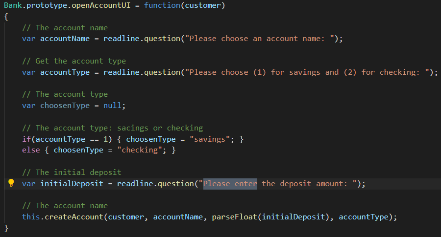

* openAccountUI Issue Explanation 
This function is problematic because the initialization of <i>var</i> variables and lack of input validation. Since the variables are of type <i>var</i>, instead of <i>let</i>, these variables will be available to the whole program instead of just within the function scope. Some useful input validations that we can fix in this snippet is to check that a <strong>choosenType, accountType,</strong> and <strong>initialDeposit</strong> are valid values before adding the account to the list of <strong>createdAccounts</strong>. Because out solution is too big for screenshot, please refer to our code at line 425 for the complete solution.

* Revised openAccountUI Code Snippet 
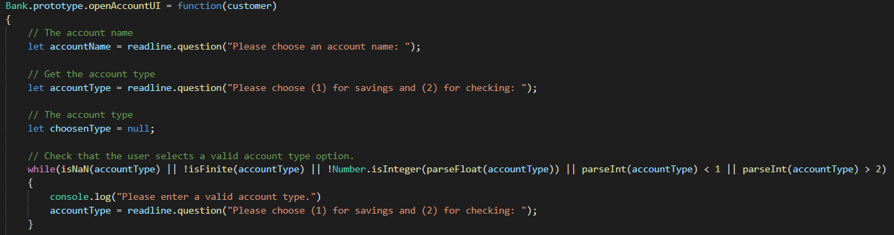

<strong>Bank Function: closeAccount</strong> 
* closeAccount Issue Explanation 
The <strong>userActionMenuUI</strong> function gives option <i>7</i> to close the account; however, this function does not exist in the program. This issue was resolved by creating the <strong>Bank.prototype.closeAccount</strong> function that takes in the customer name. THe function has input validation and ensures the proper warnings to be displayed. The function does not allow the user to delete their only existing account, enter an invalid account number, and gives the user the option to transfer the existing balance of the closing account to an existing account. The function also properly accesses the user's data and updates the current balance of accounts being transfered to.

* closeAccount Code Snippet 
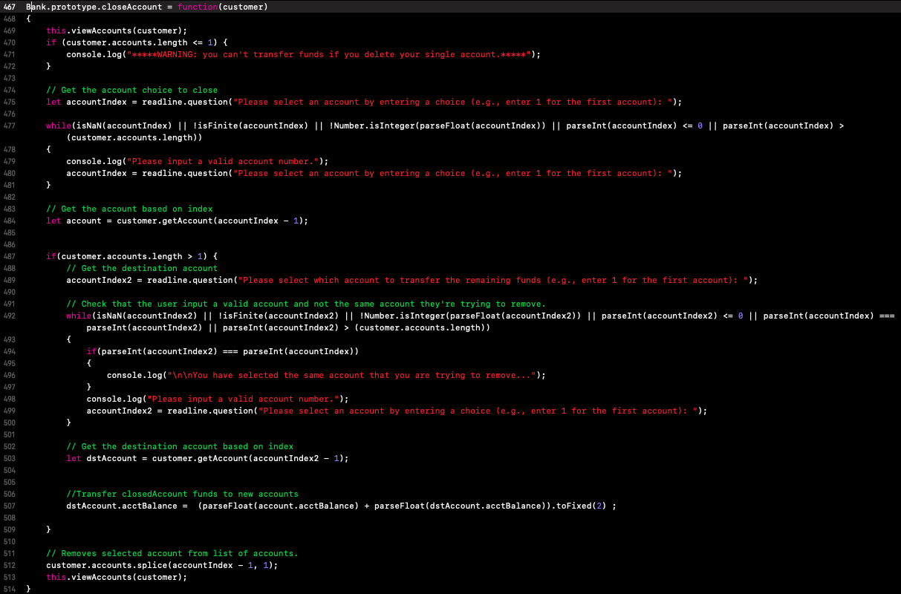

<strong>Bank Function: withdrawUI</strong> 
* withdrawUI Code Snippet 
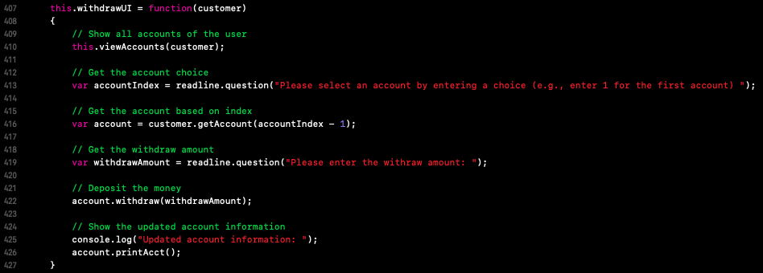

* withdrawUI Issue Explanation 
The <strong>withdrawUI</strong> function is expected to allow users to withdraw funds from their accounts and correctly update the amount; however, it is currently not working. The issues of the function includes the <i>var</i>s and <i>let</i>s issue and lack of input validation. The solution to this issue is to first change the data types, check that the withdraw amount is not less than 0, is not greater than the current account balance, and is a valid number.

* Revised withdrawUI Code Snippet 
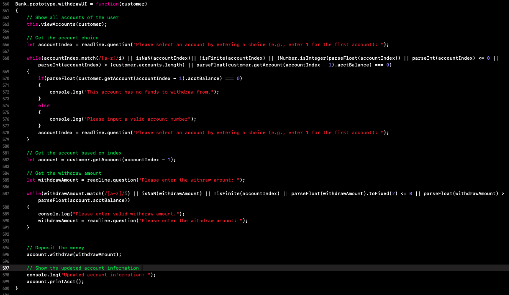

<strong>Bank Function: transferUI</strong> 
* transferUI Code Snippet 
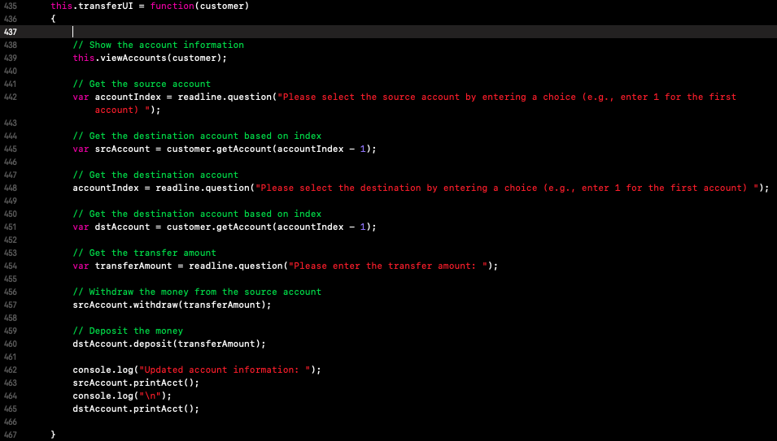

* transferUI Issue Explanation 
The <strong>transferUI</strong> function should be able to get the user's account and transfer the correct amounts between the accounts. The functions issues includes <i>var</i>s and <i>let</i>s issue and lack of input validation. The solution is to, first, change the data types of the variables. Next, would be to check that only valid account numbers are selected, for both the source and destination accounts, and check valid transfer amounts. Because the solution for this issue is too big for a screenshot, please refer to line 608 in our program.

* Revised transferUI Code Snippet 
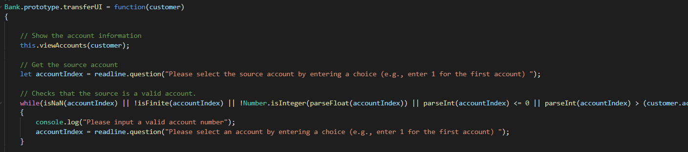

<strong>Bank Function: masterChoice</strong> 
* masterChoice Code Snippet 
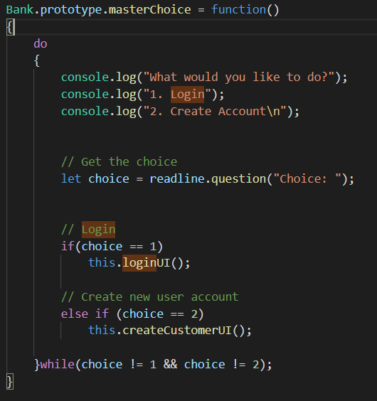

* masterChoice Issue Explanation 
The <strong>masterChoice</strong> is the initial menu that prompts the user to either login or create a new user account. The issue with the <strong>masterChoice</strong> function is that the <strong>choice</strong> variable is defined within the scope of the <i>do-while</i> loop, instead of outside. Because it is good practice to set all variables to <i>let</i>s, the scope of <strong>choice</strong> is restricted to only the <i>do</i> block. If the user were to enter anything other than 1 or 2, the <strong> choice</strong> variable reference will not be reachable to the <i>while</i> condition and crash the program. The lack of input validation within the condition pose another potential issue by not absolutely comparing values or checking if it's a valid value. The solution to these issues would be to use input validation for the values, initlialize these variables outside of the loop, and allow them to be used within the scope of the function. 

* Revised masterChoice Code Snippet 
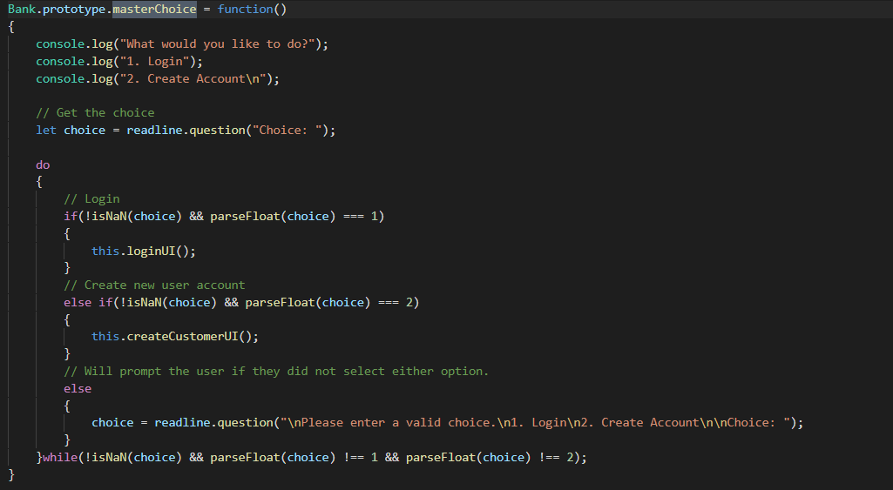

<strong>Bank Function: loginUI</strong> 
* loginUI Code Snippet 
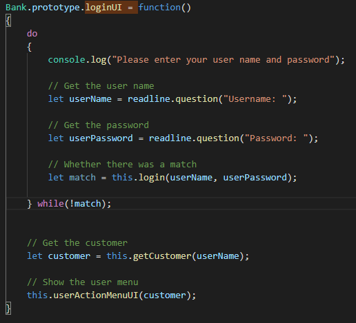

* loginUI Issue Explanation 
The <strong>loginUI</strong> function prompts the user to enter their username and password to login to their bank account. The issue with the <strong>loginUI</strong> function is that the <strong>match</strong> and <strong>userName</strong> variables were intialized within the scope of the <i>do</i> block and, therefore, unreachable by the <i>while</i> conditions. The program does not crash until the user inserts invalid credentials. This function has this similar issue with the <strong>getCustomer</strong> function attempting to acquire the <strong>userName</strong> variable as an argument. The solution to this issue to move the initialization of the variables at the beginning of the function and outside of the <i>do-while</i> loop.

* Revised loginUI Code Snippet 
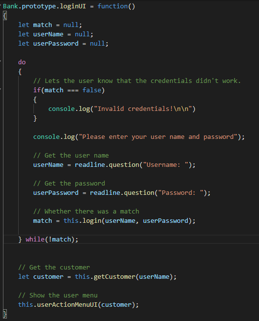

<strong>Bank Function: userActionMenuUI</strong> 
* userActionMenuUI Code Snippet 
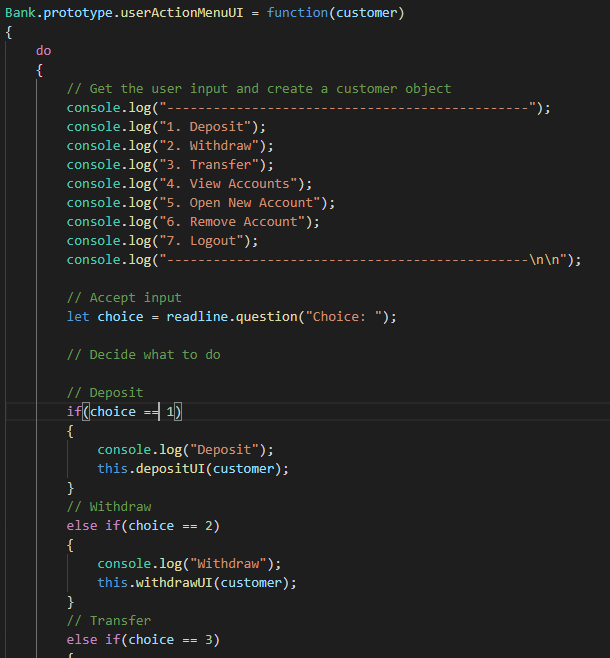

* userActionMenuUI Code Snippet 
The <strong>userActionMenuUI</strong> function prompts the user, once logged in, on what they would like to do with their account(s). The <strong>userActionMenuUI</strong> function is problematic because there is no input validation for options that do not exist and the <strong>choice</strong> variable is initialized within the <i>do</i> block of the <i>do-while</i> loop. The solution to this issue is to check for valid options and initializing the variable outside of the <i>do-while</i> loop. We also added the functionality of not allowing the user to perform the <i> deposit, withdraw</i> or <i>remove</i> functions if they have less than no accounts to perform those operations; and to not allow them to eprform the <i>transfer</i> function if they have less the 2 accounts. Because our solution is too big for a screenshot, please refer to line 169 for the complete solution.

* Revied userActionMenuUI Code Snippet 
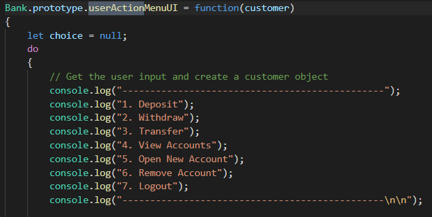

<strong>Bank Function: depositUI</strong> 
* depositUI Code Snippet 
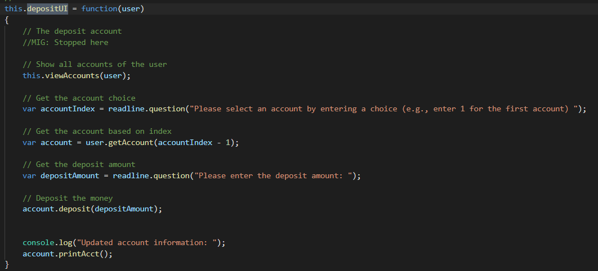

* depositUI Issue Explanation 
The <strong>depositUI</strong> function allows the user to deposit funds into their accounts. The issue with the <strong>depositUI</strong> function is that is uses <i>var</i> variables instead of <i>let</i> variables, lacks input validations for proper values/amounts. The solution to this issue would be to change the variables to the <i>let</i> data type and check the user's input by validating that it is not 0 or less, and that it is a number. Because out solution is too big for a screenshot, please refer to line 519 for the complete solution.

* depositUI Code Snippet 
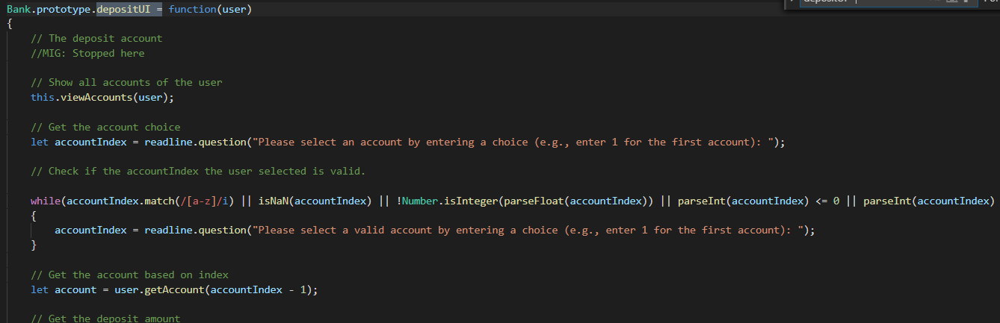

 
 
<strong><<< END OF DOCUMENTATION >>></strong>
