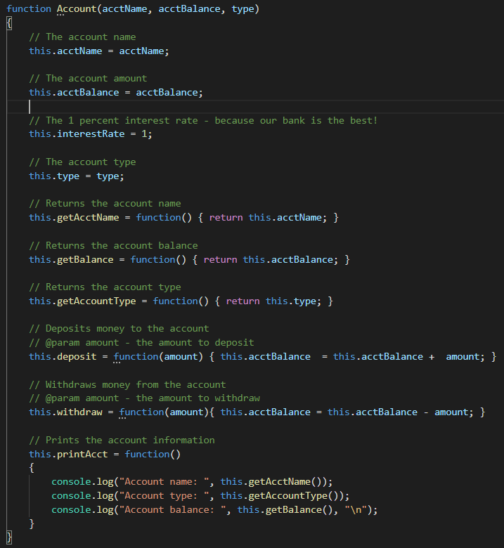
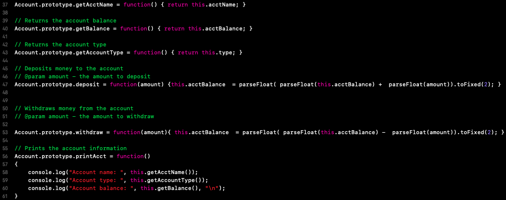
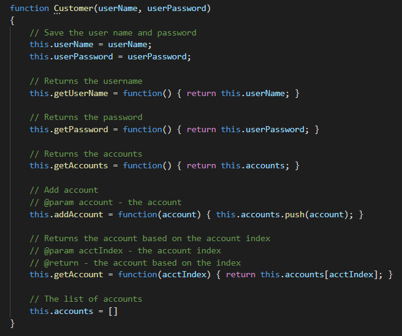
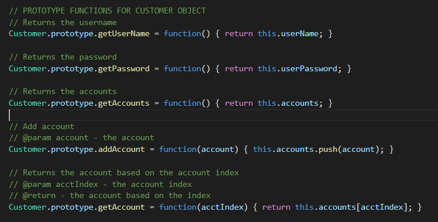
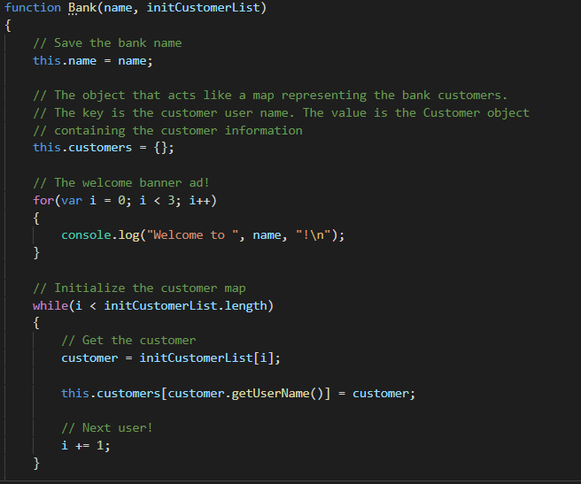
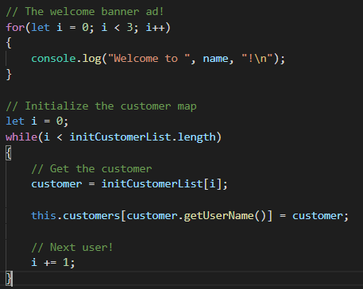

# Bank
Web Security Quiz Assignment #1  
Dr. Gofman - CPSC 455 - W 7-9:45  

# Members
Dan Ortiz (dbortiz@csu.fullerton.edu) 
Bryan Cuevas (bcuevas001@gmail.com) 
Jazmin Esqueda (jazminesqueda@csu.fullerton.edu) 

# Language
JavaScript

# How to Execute
With the proper node modules and packages installed, you should be able to execute the program by: 
<strong>node bank.js</strong>

# Issue, Issue Explanation, Solution
<strong>Account Function (Object)</strong> 
* Account Object Code Snippet 

* Account Object Issue Explanation 
The <strong>Account</strong> object violates the code's objective to being efficient due to the creation
of functions within the object. In order to make it more efficient, we should prototype the functions
for the <strong>Account</strong> object so that each new instance can point to the object's set of functions
instead of creating new functions every time.

* Revised Account Object Code Snippet 

<strong>Customer Function (Object)</strong> 
* Customer Object Code Snippet 

* Customer Object Issue Explanation 
The <strong>Customer</strong> object violates the code's objective to being efficient due to the creation
of functions within the object. In order to make it more efficient, we should prototype the functions
for the <strong>Customer</strong> object so that each new instance can point to the object's set of functions
instead of creating new functions every time.

* Revised Customer Object Code Snippet 

<strong>Bank Function (Object)</strong> 
* Bank Object Code Snippet 

* Bank Object Issue Explanation 
The <strong>Bank</strong> object violates the code's objective to being efficient due to the creation
of functions within the object. In order to make it more efficient, we should prototype the functions
for the <strong>Bank</strong> object so that each new instance can point to the object's set of functions
instead of creating new functions every time. Because the <strong>Bank</strong> object has several functions
for a screenshot, please refer to line 133 of the original, unedited program to see them. Our solution
of prototyping the <strong>Bank</strong> object's functions can be referenced on line 144 of our program.
In this particular part of the program, the variable <strong>i</strong> has been initialized within the
for-loop as a <i>var</i> rather than a <i>let</i>. The issue with this is that because <strong>i</strong>
is initialized as <i>var</i> rather than a <i>let</i>, it will be scoped to the whole program instead of
the intended scope of the for-loop. This issue will affect the following while-loop that initializes the
customer map because it will use the variable <strong>i</strong> with it's last initialized value from the
for-loop; thus, leaving a part of the list empty. There are several ways to fix this issue, and our group
decided to reinitialize <strong>let i = 0</strong>.

* Revised Bank Object Code Snippet 

